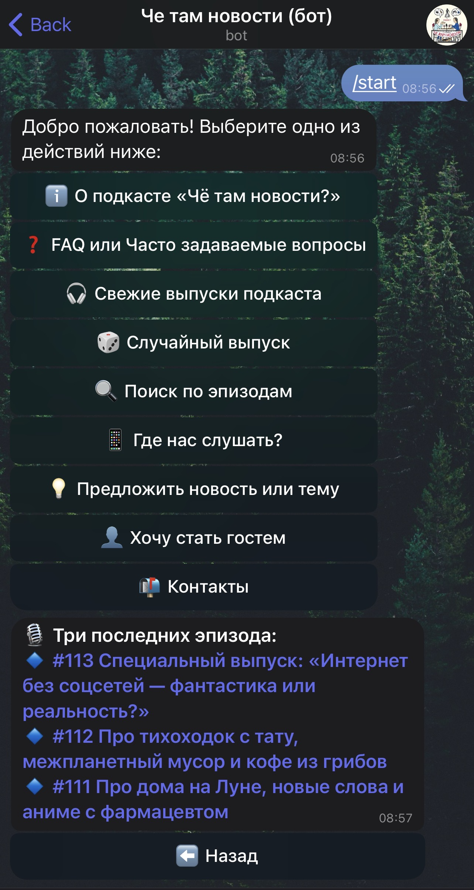

# CheTamNovostiBot 🎙️

Телеграм-бот подкаста «Чё там новости»: поиск выпусков, случайный эпизод, авто-постинг.  

🖥️ Продакшн-версия работает на приватном VPS (бот доступен 24/7).  
🔒 В репозитории — только витрина: код, requirements, README, примеры и CI.  
👉 Попробовать вживую: [t.me/CheTamNovostiBot](https://t.me/CheTamNovostiBot)

---

## Функции
- Поиск по эпизодам, краткие описания, кнопки со ссылками на платформы  
- Случайный выпуск (/random)  
- Автопостинг новых эпизодов в канал  
- Кэширование RSS и база пользователей (aiosqlite)

## Технологии
Python · python-telegram-bot v20 · aiosqlite · feedparser · asyncio  

---

## Demo

> См. [PORTFOLIO_ONLY.md](PORTFOLIO_ONLY.md) для пояснения.

---

---

> English version: [README_EN.md](README_EN.md)
