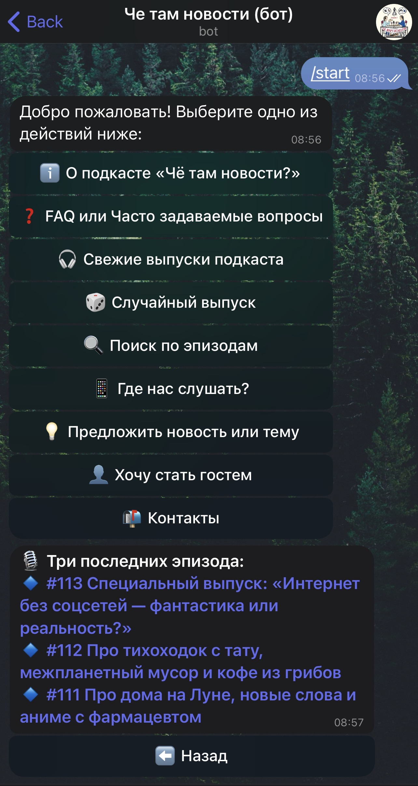

# CheTamNovostiBot 🎙️

Telegram bot for the podcast *"Che Tam Novosti"* ("What's Up News"): search episodes, get random picks, and auto-post updates.

🖥️ The production version runs on a private VPS (24/7 uptime).  
🔒 This repository is portfolio-only: it contains example code, requirements, README, and CI — no secrets or tokens.  
👉 Try the live bot: [t.me/CheTamNovostiBot](https://t.me/CheTamNovostiBot)

---

## Features
- Search episodes, preview details, quick links to podcast platforms  
- Random episode (/random command)  
- Auto-post new episodes to a Telegram channel  
- RSS caching and user database (aiosqlite)

## Tech Stack
Python · python-telegram-bot v20 · aiosqlite · feedparser · asyncio  

---

## Demo

> See [PORTFOLIO_ONLY.md](PORTFOLIO_ONLY.md) for portfolio disclaimer.
